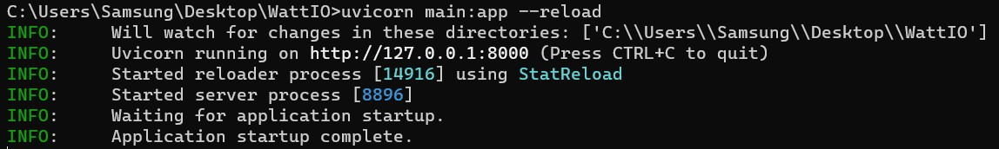

# CRUD-de-Filmes

## SOBRE
O CRUD-de-Filmes é uma API que retira de uma base JSON: Nome, Ano e Diretor de um filme e permite manipulação dessa base, podendo consultar, adicionar, editar ou remover um filme.

A API é toda composta no arquivo main.py, que contém toda lógica e código da API. 

Para o funcionamento e teste, foi disponibilizado dois arquivos JSON:
  - config.json (Contém o último ID a ser utilizado)
  - filmes.json (Contém o Nome, Ano e Diretor de cada filme no registro)
  
Esses arquivos são obrigatórios para o funcionamento!

Ainda, vou disponibilizar o arquivo requirements.txt para ser instalado as bibliotecas nas versões conforme a do meu computador, contudo, não é necessário usá-lo caso já tenha instalado no seu computador.

## INSTALAÇÃO

[OPCIONAL] 1º Passo - No Prompt de Comando ou no Terminal, rodar o seguinte comando:

```sh
pip install --no-cache-dir -r requirements.txt
```

---------------------------------------------------------------------------

2º Passo - Rodar o Uvicorn no Prompt de Comando ou no Terminal:

```sh
uvicorn main:app --reload
```

> OBS: _Tem que estar sendo rodado na pasta em que estão os arquivos da API. Caso não esteja, usar o comando "cd" para mudar até o diretório que contém os 3 arquivos._



----------------------------------------------------------------------------

3º Passo - Acessar o server hospedado pelo uvicorn:

Ao rodar o passo acima bem sucedido, conforme a imagem, basta apertar o CTRL e clicar sobre o link.
Outra opção, é digitar no navegador.

```sh
127.0.0.1:8000
```

Para os testes, deve ser acessado:
```sh
127.0.0.1:8000/docs
```
Nesse acesso, tem todos as rotas para serem testadas. Basta apenas clicar sobre a rota desejada e clicar na opção "Try Out".

----------------------------------------------------------------------------

A API já está funcionando. As rotas retornam:

  - `[GET] "/filmes"`: Retornam todos os filmes na base de dados.
  
  - `[GET] "/filmes/{id}"`: Retorna o filme equivalente ao id passado como parâmetro.
  
  - `[POST] "/filmes"`: Insere um filme no banco de dados. Requer que seja passado como parâmetro um modelo cujo mínimo a ser informado é o Nome do filme. Ano e Diretor são opcionais e vem como padrão Null/None. O id do filme vem do arquivo config.json e a cada post feito, é atualizado e salvo no mesmo arquivo. Após cada inserção, o banco de dados é atualizado e salvo.
  
  - `[PUT] "/filmes/{id}"`: Edita um filme dado o id. Requer que seja passado como parâmetro um modelo onde só é alterado os campos diferentes de nulo. 
  
  - `[DELETE] "/filmes/{id}"`: Remove o filme da base de dados. Esse id não será usado mais em nenhum post, para manter sem alteração os id dos demais filmes e o id contido no arquivo config.json.
